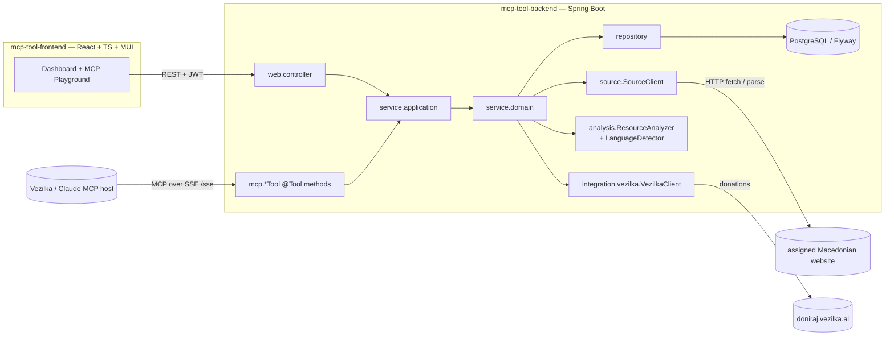

# MCP Tool Template — Macedonian Resource Search & Analysis for doniraj.vezilka.ai

Template for the EMC course project: an **MCP (Model Context Protocol) server**
that **searches and analyzes a specific website of Macedonian-language
resources**, and **donates** the results to
[doniraj.vezilka.ai](https://doniraj.vezilka.ai) — the platform for preserving
the Macedonian language. The MCP tools are consumed by an MCP host (the Vezilka
agent, Claude, or the MCP Inspector); a React dashboard drives and observes the
same functionality over REST.

Секој студент добива **еден** веб-сајт (доделен од професорот) и го имплементира
MCP-алатникот за него, следејќи ја оваа заедничка архитектура. Шаблонот се
компајлира и стартува веднаш — вашата задача е да ги имплементирате местата
означени со `TODO(student)`.

## Architecture

The project follows the course reference architecture (`emc-2026` / e-shop):
layered backend (`web` → `service.application` → `service.domain` →
`repository`), record DTOs with `from()`/`to*()` mapping, Flyway-owned schema,
stateless JWT security, and a React + MUI frontend with the
api/contexts/providers/hooks structure. On top of that, an **MCP server** layer
exposes the same domain as agent-callable tools.



The MCP tools and the REST controllers are **two entrypoints over the same
service layer**. A search runs synchronously: the `search_resources` tool (and
`POST /api/search-runs/run`) fetch from the assigned website, score each result
for Macedonian, and persist it. Every MCP tool call is recorded as a
`ToolInvocationLog` so the frontend can show a live trace.

## MCP tools

| Tool | Purpose | Status |
|------|---------|--------|
| `corpus_stats` | Aggregate corpus statistics | **provided (reference)** |
| `search_resources` | Search the assigned website and store results | `TODO(student)` |
| `get_resource` | Fetch one stored resource | `TODO(student)` |
| `analyze_resource` | Analyze a resource (summary, keywords, stats) | `TODO(student)` |
| `donate_resource` | Donate a resource to doniraj.vezilka.ai | `TODO(student)` |

## Getting started

Prerequisites: Java 21, Node 20+, Docker.

```bash
# 1. Database
cd mcp-tool-backend
docker compose up -d

# 2. Backend  (http://localhost:8080, Swagger at /swagger-ui/index.html)
./mvnw spring-boot:run

# 3. Frontend (http://localhost:3000)
cd ../mcp-tool-frontend
npm install
npm run dev
```

Register and log in — auth is fully working. Every unimplemented endpoint
returns **HTTP 501 Not Implemented** with the name of the `TODO(student)` method
that is missing; as you implement them, the 501s disappear one by one.

### Configure YOUR assigned website

Point the `source.*` properties at your assigned site (via environment
variables or a `.env` file in `mcp-tool-backend`):

```bash
SOURCE_NAME="Wikipedia (mk)"
SOURCE_BASE_URL="https://mk.wikipedia.org"
SOURCE_API_KEY=            # only if your site needs one
VEZILKA_API_KEY=           # once you have Vezilka access
```

## Trying the MCP server

The server speaks MCP over **HTTP+SSE**: the event stream is at
`http://localhost:8080/sse` and messages are posted to `/mcp/message`.

**MCP Inspector** (no install needed) — verify the wiring works *before* you
implement anything:

```bash
npx @modelcontextprotocol/inspector
```

In the UI choose transport **SSE**, URL `http://localhost:8080/sse`, connect,
and invoke **`corpus_stats`** — you should get a JSON result. The other tools
respond "not implemented" until you build them.

**Claude Desktop** (via the `mcp-remote` bridge):

```json
{
  "mcpServers": {
    "vezilka": { "command": "npx", "args": ["-y", "mcp-remote", "http://localhost:8080/sse"] }
  }
}
```

**Vezilka agent / doniraj.vezilka.ai** — register your server's public URL
(expose it with a tunnel such as `ngrok`, or deploy it) and the SSE transport.

**In-app MCP Playground** — the frontend's *Playground* page lists the tools
with their JSON Schemas and invokes them, so you can demo the MCP tools without
an external client.

Tests: `./mvnw test` (Docker must be running — Testcontainers starts a real
PostgreSQL). `UserRepositoryTest` is a working example of the expected test
pattern; the `@Disabled` skeletons are yours to implement.

## What you implement — `TODO(student)` milestones

Search the codebase for `TODO(student)` — every marker is part of the
assignment. Grouped by milestone:

| # | Milestone | Where |
|---|-----------|-------|
| 1 | **SourceClient** — fetch/parse YOUR assigned website (add e.g. `org.jsoup:jsoup`) | `source/StubSourceClient` → your implementation |
| 2 | **Analysis & language** — summary/keywords/stats + Macedonian detection | `analysis/StubResourceAnalyzer`, `StubLanguageDetector` |
| 3 | **MCP tools** — `search_resources`, `get_resource`, `analyze_resource`, `donate_resource` | `mcp/ResourceSearchTool`, `ResourceAnalysisTool`, `DonationTool` |
| 4 | **Domain & application services** — search runs, resources (paged + filtered), donations | `service/domain/impl/*`, `service/application/impl/*` |
| 5 | **Vezilka integration** — submit donations, poll their status | `integration/vezilka/StubVezilkaClient`, `DonationService.submit/refreshSubmittedStatuses` |
| 6 | **Frontend features** — resource browser & filters, donation workflow, home stats dashboard | `hooks/useResources,useDonations,useStats`, `ui/components/resource\|donation/*`, pages |
| 7 | **Tests** — repository + integration tests following the provided pattern | `src/test/java/...` (`@Disabled` skeletons) |

Fully provided (do **not** reimplement): JWT auth (backend + frontend), the MCP
server wiring + the `corpus_stats` reference tool + the MCP-playground invoke
endpoint, `ToolInvocationLogService`, `StatisticsService`, Flyway migrations
V1–V5, the controllers, the exception handlers, the **Search Runs** vertical
slice on the frontend (the reference example of the provider/hook pattern), and
the donation-status scheduler.

## Rules

1. **Do not break the layering.** Controllers and MCP tools speak DTOs and call
   only `service.application` interfaces; application services map DTO↔entity
   and call `service.domain` interfaces; domain services speak entities and call
   repositories and the seams. MCP tools return **DTOs/records, never JPA
   entities** (Jackson serialization).
2. **Do not change the shared abstractions** (`SourceClient`,
   `ResourceAnalyzer`, `LanguageDetector`, `VezilkaClient`) or the MCP wiring.
   Extend, don't edit. New migrations go in new Flyway versions (`V6__...`),
   never in edits to V1–V5.
3. **Keep the conventions**: record DTOs with `from()`/`to*()` (no mapper
   libraries), constructor injection, per-controller exception handlers;
   frontend one-folder-per-component, contexts/providers/hooks triads, default
   exports for components and named exports for types.
4. **Secrets stay out of git**: the website API key, the Vezilka API key and the
   JWT secret belong in `.env` / environment variables.

## A note on the MCP transport & versions

This template uses **Spring AI 1.0.9** (compatible with Spring Boot 3.4.3), whose
WebMVC MCP starter exposes the **HTTP+SSE** transport. The newer
*streamable-HTTP* transport requires Spring AI 1.1.x (Spring Boot 3.5) or 2.0
(Spring Boot 4). The `@Tool` + `MethodToolCallbackProvider` pattern used here is
identical across versions, so upgrading later is a BOM + Boot bump only. Do not
mix BOM lines.

## A note on the doniraj.vezilka.ai integration

doniraj.vezilka.ai does not publish an API. The integration is abstracted behind
`VezilkaClient` with a configurable `vezilka.base-url` / `vezilka.api-key`;
confirm the concrete endpoint and authentication with the Vezilka team
(contact@vezilka.ai) or your professor, then implement `StubVezilkaClient`
accordingly (a real HTTP API or an automated submission flow, as agreed).

## Responsible use

The tool exists to help preserve the Macedonian language. Extract only publicly
accessible content, respect the target website's terms of service and
`robots.txt` and rate limits, don't collect private or sensitive personal data,
and keep the source URL of everything you donate — provenance matters for the
corpus.

## Project layout

```
mcp-tool-template/
├── mcp-tool-backend/     Spring Boot 3.4 / Java 21 / Maven / PostgreSQL + Flyway / Spring AI MCP
│   └── src/main/java/mk/ukim/finki/mcptoolbackend/
│       ├── mcp/            @Tool methods + ToolCallbackProvider   ← the MCP tools (the assignment core)
│       ├── source/         SourceClient seam                      ← YOUR assigned website
│       ├── analysis/       ResourceAnalyzer + LanguageDetector    ← data analysis seams
│       ├── integration/vezilka/                                   ← doniraj.vezilka.ai client
│       ├── model/          domain | dto | enums | exception
│       ├── repository/  service/domain/  service/application/
│       ├── web/            controller | dto | filter | handler
│       └── config/  constants/  helpers/  jobs/
└── mcp-tool-frontend/    React 19 / TypeScript / Vite / MUI
    └── src/
        ├── axios/  api/ (+ api/types/)
        ├── contexts/  providers/  hooks/
        └── ui/  pages | components  (one folder per component)
```
